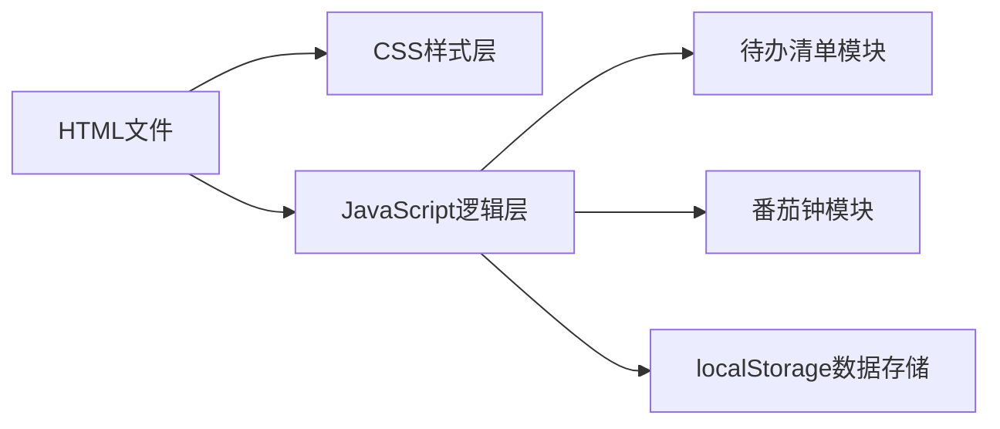

## 1. 架构设计



## 2. 技术描述
- 前端：纯HTML + CSS + JavaScript（单文件）
- 数据存储：localStorage
- 兼容性：iOS/Android现代浏览器

## 3. 文件结构
| 文件 | 用途 |
|------|------|
| index.html | 主入口，包含所有代码 |

## 4. 数据结构

### 4.1 待办数据
```javascript
{
  id: number,
  text: string,
  completed: boolean
}
```

### 4.2 番茄钟数据
```javascript
{
  mode: 'focus' | 'shortBreak' | 'longBreak',
  timeLeft: number, // 秒
  isRunning: boolean
}
```

## 5. 模块化设计

### 5.1 待办清单模块
- `TodoModule` - 独立封装待办功能
- 数据存储key: `workbench_todos`

### 5.2 番茄钟模块
- `PomodoroModule` - 独立封装番茄钟功能
- 数据无需持久化历史

## 6. 关键实现点
1. 使用CSS `conic-gradient`实现饼图
2. CSS动画实现页面切换效果
3. 键盘事件监听实现快捷键
4. Blob API实现JSON导出
