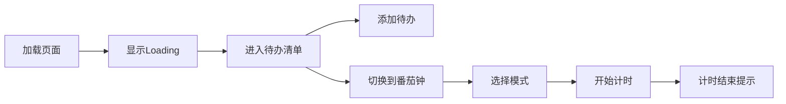

## 1. 产品概述
多功能工作台是一个单页应用，集成待办清单和专注番茄钟两个核心工具，帮助用户提升工作效率。
- 目标用户：需要管理任务和专注工作的个人用户
- 市场价值：提供简洁美观、功能完整的效率工具

## 2. 核心功能

### 2.1 用户角色
| 角色 | 注册方式 | 核心权限 |
|------|---------|---------|
| 普通用户 | 无需注册 | 使用所有功能，数据本地存储 |

### 2.2 功能模块
1. **主页面**: 导航栏切换、待办清单工具、专注番茄钟工具
2. **待办清单**: 添加/删除待办、勾选完成、数据统计、导出功能
3. **专注番茄钟**: 计时器、三种模式、开始/暂停/重置

### 2.3 页面详情
| 页面名称 | 模块名称 | 功能描述 |
|---------|---------|---------|
| 主页面 | 导航栏 | 标签页切换工具，带平滑过渡动画 |
| 主页面 | 待办清单 | 添加、删除、勾选待办，显示统计和完成率饼图，导出JSON |
| 主页面 | 专注番茄钟 | 25/5/15分钟三种模式，计时器控制，完成提示 |

## 3. 核心流程

## 4. 用户界面设计

### 4.1 设计风格
- 主色调：柔和的蓝紫色渐变
- 按钮风格：圆角、毛玻璃效果、点击反馈动画
- 字体：现代无衬线字体
- 布局：卡片式布局，最大宽度560px居中
- 图标：SVG抽象插画和几何装饰元素

### 4.2 页面设计概述
| 页面名称 | 模块名称 | UI元素 |
|---------|---------|--------|
| 主页面 | 导航栏 | 圆角标签，当前选中高亮 |
| 主页面 | 待办清单 | 渐变背景卡片，待办项带checkbox，饼图展示完成率 |
| 主页面 | 专注番茄钟 | 大数字时钟，模式切换标签，控制按钮 |

### 4.3 响应式设计
- 移动端优先，最大宽度560px
- 按钮触摸区域≥44px
- 375px宽度下布局正常，无横向滚动

### 4.4 动画与交互动效
- 页面加载Loading Spinner（0.3秒后消失）
- 标签切换淡入淡出+上浮动画
- 按钮点击缩放效果（0.96倍）
- 数据变化数字滚动效果
- Toast操作反馈提示（2秒自动消失）
